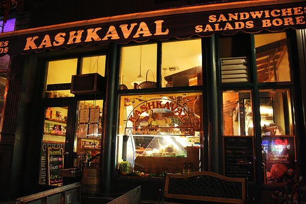
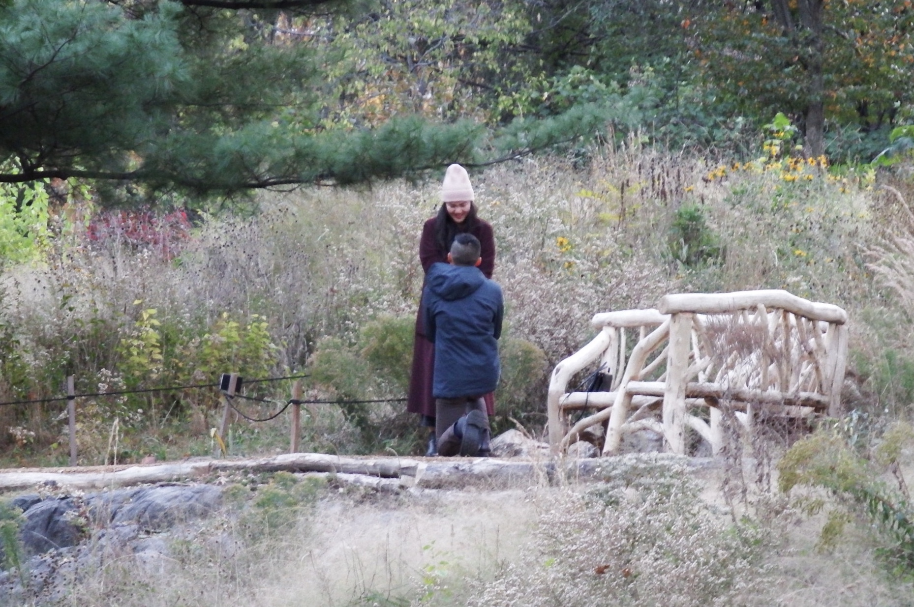

<section id="banner">
  

## Paula and Ken
Stockholm | Sweden

[Please RSVP by August 24](https://goo.gl/forms/6C8o60ct7j0OxMdJ2){: .button }{:target="_blank"}

  

</section>

<section class="wrapper style1">

<header class="major" markdown="1">

## CELEBRATE
 
In the fall of 2016, we visited Artipelag as part of a trip to Scandinavia. So much about this museum appealed to us - the sleek glass-walled architecture, the manageable size of the exhibition (on Warhol at the time) and in particular, its magical pine forest surroundings.
 

 
When it came time to choose a location for our wedding, we wanted a place that spoke to both of us. Artipelag melds contemporary art and nature into one experience, which feels right as our wedding venue because it mirrors us, reflecting our separate interests that have become increasingly shared.
 
As we prepare for the wedding, we've been thinking a lot about the friends and family who have helped shape us individually and have supported us as a couple. You mean so much to us and we can't wait to celebrate with you in one of our favorite corners of the world.
 
## OUR STORY

<section id="two" class="wrapper alt style2">
						<section class="spotlight">
							

	<h5>One fall evening in 2013...</h5>
								
Paula made a fateful decision – instead of cozying up in her UWS studio with a Netflix DVD, she went out. It was Friday night, after all, and she was single. Paula made her way over to Liberty Bar near K-town where someone she knew was having a birthday party.

							

						</section>
						<section class="spotlight">
							

								
Ken also made a fateful decision, one he still makes nearly every weekend - to stay out that Friday night, which began for him at happy hour and ended at his fourth stop, Liberty Bar. When introduced to Paula, he was on his thirteenth drink that evening yet remained impressively coherent.

							

						</section>
						<section class="spotlight">
	
<i>The notes are still in Ken’s phone, plus two addendums later in 2013.</i>

								
Paula was instantly taken by the fit of Ken’s shirt and his liquid-fueled confidence. She also liked that Ken had set a photo of Machu Picchu as his iPhone background, as she had also done the trek. Ken was impressed by Paula’s drink order of Jameson on the rocks and was tricked into thinking Paula was athletic by her casual mention of the century bicycle rides she had done that year. He asked for her number and then jotted down observations about her into his phone: Wharton, Whitney/Cerritos, Cannondale, Amazing.

							

						</section>
						<section class="spotlight">
							

								
Ken waited two days to text Paula, per “The Game.” She was at The Brooklyn Book Festival and knew how to play that game, too - she waited to text him back until later that evening. They went on their first date at Kashkaval (RIP), a casual Mediterranean wine bar in Midtown West. It went just okay but not so badly that Paula would refuse a second date - so, they met again at Khe-Yo in Tribeca where Ken made an outsized impression by showing up in a tailored suit. Sparks were reignited. Dates three and four followed in quick succession, where they shared about their families, discussed their dreams and deepened their connection.

							

						</section>
						<section class="spotlight">
							
<i>With Jazz Musician Brian Newman. October 15, 2013</i>

								
								
Their fifth date was at The Rose Bar in Gramercy, three weeks after they first met. With the sound of Brian Newman’s trumpet in the background, Ken took Paula’s hand and asked an old-fashioned question, “Will you be my girlfriend?” It was made official in the following moment, when both their Coffee Meets Bagel accounts were summarily deleted.

							

						</section>
						<section class="spotlight">
							
<i>The Dene Slope in Central Park. November 4, 2017</i>

								
The next time Ken asked Paula an old-fashioned question while holding her hand was at a bench in Central Park, four years later. By then, Paula knew that Ken was The One. She had felt his love early on, when he had spent his Saturdays helping her do laundry at the laundromat down the street from her walk-up. She found his tendencies endearing – how he ensured all their devices were always charged, how he thoroughly read every placard he came upon, whether at a museum or while walking by a random statue, and even how he vigilantly placed coasters beneath every beverage at their hosted get-togethers. She loved laughing with him and how he made her feel secure and prioritized. As for Ken, he had felt sure of Paula since he took those notes about her on Day 1.

							

						</section>
						<section class="spotlight">
							
<i>At Fallingwater in Mill Run, PA. October 14, 2017M</i>

								
Almost five years to the day they became a couple, Paula and Ken will commit to forever with their dearest friends and family in Stockholm, Sweden.

							

						</section>
					</section>
</header>

</section>
<section class="wrapper style5">

### Celebration Schedule

#### Friday, October 5th

| Time | Activity |
| -------------------- | ------------- |
| 6 - 10 PM | **Welcome Dinner at an Organic Farm**   [Rosendals Trädgård](http://www.rosendalstradgard.se/in-english/)   [Rosendalsvägen 38, 115 21 Stockholm, Sweden](https://goo.gl/maps/xL4M4WgS61K2)    *Dressy casual*  Rosendals Garden is located at Royal Djurgården, behind Skansen.  Go by tram no 7 from Kungsträdgården towards Waldemarsudde to the Bellmansro stop. From here it is a five minute walk to the garden. By taxi/uber use the GPS address Rosendalsvägen 38. |

#### Saturday, October 6th

| Time | Activity |
| -------------------- | ------------- |
| 2 - 3 PM  | **Wedding Ceremony**   St. Eric's Cathedral   [Folkungagatan 46, 118 26 Stockholm, Sweden](https://goo.gl/maps/af1iivMnYZr)    *Formal Attire*  Doors open at 1:30 PM, ceremony starts promptly at 2:00 PM.|
| 3:30 - 5 PM  | **Boat Ride to Artipelag**   [Nybrokajen Harbor](https://goo.gl/maps/tejd9CRFi132)   Board a classic, turn-of-the-century ship for a cruise through the Stockholm Archpelago to Artipelag    *Bus transportation will be provided from the ceremony to the harbor* |
| 5 PM - 12 AM  | **Cocktails, Dinner, and Dancing**   [Artipelag Museum](https://artipelag.se/en/)   *Bus transportation will be provided from the museum to the Miss Clara hotel at the end of the night*| 
| 12 - 2 AM | **After Party**   TBD |

Please dress appropriately for the weather and especially for the boat ride. Stockholm averages 55 °F / 13 °C in early October.

</section>
<section class="wrapper style5">

## Accommodations 🏠

### Miss Clara Hotel

We have a room block available with multiple options at the Miss Clara Hotel in the Norrmalm neighborhood of Stockholm. We'll be staying here and this is where the bus will drop everyone off after the reception.

[Miss Clara Hotel](https://missclarahotel.com/) - [Room Descriptions](https://missclarahotel.com/rooms)

| Standard Single | Sleeps 1 | $180/1590 SEK per night |
| Standard Double | Sleeps 2 | $205/1790 SEK per night |
| Superior Double | Sleeps 2 | $239/2090 SEK per night |
| Deluxe Double | Sleeps 2 | $273/2390 SEK per night |

*Please contact Rebecka Wirf directly and mention Paula Lee's room block to reserve a room at a discounted rate. The discounted rate is only available until August 30. The hotel may also be available using points via SPG or Chase Rewards.*

Rebecka Wirf
 Meetings & Events Coordinator
 +46 (0)8 440 67 50
 [reservation@missclarahotel.com](mailto:reservation@missclarahotel.com)

</section>

<section class="wrapper style2 special">

[Please RSVP by August 24](https://goo.gl/forms/6C8o60ct7j0OxMdJ2){: .button }{:target="_blank"}

  See you there! 😀

</section>
